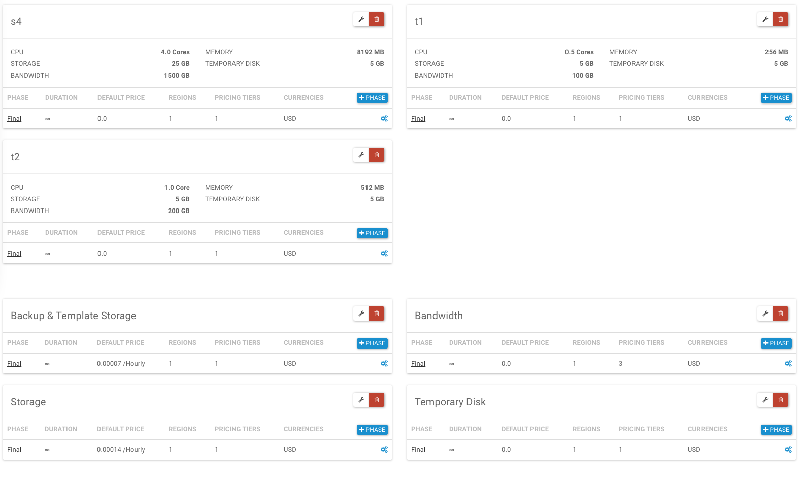

# Billing: Plans

ComputeStacks uses billing plans as a rule set for determining the real time price for a given resource. We also use this for generating the price matrix on order forms.

You can create as many billing plans as you want, but only one may the default. This is useful for creating custom or special pricing for a different set of users.

!!! note
    If no price rule exists for a given scenario *(e.g. currency + region + quantity)*, ComputeStacks will default to a price of 0.00.

## Billing Plans

When creating a billing plan, you will have an option to set the term used.

- **Hourly:** Prices are per-hour
- **Monthly:** Prices are per-month

It’s important to note that even with monthly pricing, ComputeStacks will still treat that as post-bill. So, when a user orders a monthly package, they will get a usage item in the database for that through the end of the month, however, we are expecting that your billing system will not generate an invoice until the following month. This is an important distinction to ensure upgrades, downgrades, and cancellations are handled appropriately.

!!! warning
    **Pricing for overage storage *(backup, temporary, volume)* will always be per-hour.**

Once you have your billing plan, you may assign it to a particular user group.

## Products & Packages

A product is a separate object from Billing Plans, which allow you to define it once, and use it in multiple plans.

### Creating a Product

Products are the base for packages, so you must define this first prior to creating a package.

- **External ID**
    
    This is available in [WebHooks](../../integrations/webhooks.md) and API Calls. This is generally used by billing integrations to identify this product.
    
- **Package or Metered Resource**:
    - **Package:** Container package
    - **Image:** Container Image
    - **Metered Resource:** Bandwidth, Storage.
- **Resource**
    
    Only applies of 'Kind' is 'Metered Resource'
    This tells ComputeStacks what kind of resource this is. When we're calculating pricing on the hour, we will use this value to find the price for a given resource.
    
- **Unit**
    
    This should almost always be 1.
    
- **Unit Type**
    
    `CORE` for `CPU`, `MB` for Memory, and `GB` for bandwidth and storage.
    

### Package Settings

After creating a product, and selecting *Package* as the product kind, you will have the ability to customize the package resource.

??? note "Cpu"
    
    How many CPU Cores to assign. These can be fractional units of `0.25`.
    
- **Memory**
    
    Memory is stored in `MB`.
    
- **Volume Storage**
    
    Anything over this amount will be charged at the current storage rate set in the users billing plan.
    
- **Temporary Disk**
    
    Temporary disk is all storage used by the container, less any volume usage. Anything over this amount will be charged at the current temporary disk rate set in the users billing plan.
    
- **Bandwidth**
    
    Up to this amount is included, anything else will be charged as overage.
    
- **Backup Storage**
    
    Anything beyond this will be charged as overage.
    

## Billing Phases

Phases are a way to describe the current state of a subscription. There are three possibilities: Trial, Discount, and Final.

Phases only move forward and never backwards. The transition to the next phase is automatic and based on the duration of that phase.

The duration defined in the phase is the *maximum* amount of time the subscription will stay in the phase. The actual time frame will depend on the `billing_start` field for a given user. The *billing start* is automatically set when a user places their first order. This can also be set manually by an administrator at any time.

For example, if a trial phase is set to last for *14 days* and a user placed their first subscription for a different order 7 days ago, they will get a free trial for 7 more days.

So for Trial and Discount phases, the time frame not only applies to how long a given subscription will be in that phase, but also the total amount of time they have access to that phase.

## Billing Resources

Billing resources are the parent object of the product being added to a billing plan. A resource holds the phases, and their prices. When adding a product to a billing plan, you’re creating a billing resource. The following options are available:

- **External ID:** Used for your billing integration. You can choose to give this an ID that matches a product/price pair in your billing system to easily match a user’s product, with a particular price in your billing system.
- **Prorate existing usage?:** If you setup monthly billing, when a user places an order, they will immediately incur a usage item for that item through the end of the month.
    
    
    *For example*: An order is placed on November 15th for a $10/month package. They will immediately have a usage item created for $5.00 for November 15 - 30.
    
    When that prorate billing option is enabled, should they choose to cancel or upgrade/downgrade later in the month, the usage item will be updated with a new end date of today’s date. Effectively, they would get a refund for their unused usage, however since we always post-bill at the end of the month, no actual billing event has occurred, and this is just an accounting update.
    
    This may seem like an obvious setting to always have enabled, however there are situations (particularly with software licenses), where you may require a minimum commitment to use an image, and once it’s ordered the user needs to pay for the entire term. With that being said, because this setting is per-product, you may choose to have this enabled on the package, while keeping it disabled on the image. In the above scenario where the user cancels their paid image in a term, they could have their resource usage refunded, while still being charged for the image license.
    

## Pricing

Prices are unique to their parent phase, and can be customized for specific regions, currencies, and quantity.

### Multiple Currencies

ComputeStacks supports *selling* in multiple currencies, which you can add to each *Billing Phase*, however we will not automatically convert a currency from a base currency, to another one.

### Tax & VAT

ComputeStacks does not calculate tax or VAT. This is generally handled by your billing system, and is done at the time an invoice is generated.

!!! tip
    There is a global default currency set during the installation process, however each user can have a different currency set by Administrators, or from the billing integration.

### Tiers

By adding a `maximum allowed quantity`, you can create tiered pricing. This is popular for storage and bandwidth.
